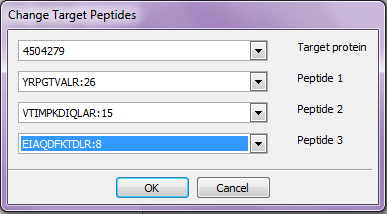

Getting start
=============

EPPI is a software to process proteomic data obtained by
mass-spectrometry analysis, with the aim to identify proteotypic
peptides (PTPs). The data processing is composed by several steps linked
between them. The steps will be described according the logical sequence
of data elaboration.\
The first step to use EPPI is to create a new project or to open an
existing one, using the Project menu (fig 1).

**fig 1:** *Project menu.*

**fig 2:** *Action menu.*

Inserting and pre-processing data: Join function
================================================

Main functions are reported in Action menu (fig 2). The Join
function permits to insert input data through a folder containing them.
EPPI accepts files produced by Bioworks 3.3.1, Discoverer 1.4, Mascot
and PRIDE. XML, XLS and mzIdentML formats are accepted (fig 4).

**fig 3:** *Join function.*

**fig 4:** *File formats EPPI is able to accept in input.*

After data are loaded, EPPI merges the input files and for each
identified peptide and protein it calculates the Identification
Frequency (IF). The results of this processing are shown in
all\_peptides table, reported in  fig 5.

![allp] (images/Eppi_all_peptides.png "All peptides table")

**fig 5:** *All\_peptides table (result of Join function). Protein: identifier
number of a given protein; \#Protein/\#Peptide: number of times that a
given protein/peptide occurs in the input files; Peptide: peptide
sequence; fProtein/fPeptide: identification frequency of
proteins/peptides.*

Selecting PTPs candidates
=========================

The output data of previous step (see  fig 5) may be further
processed using the “Select” function, that permits to filter the
identification frequency (IF) values and the extraction of proteins and
peptides with the best occurrence (fig 6).

**fig 6:** *Select function. Interface to introduce threshold values concerning
the identification frequency (IF) of proteins and peptides.*

The peptides with IF overtaking the applied thresholds are considered
“best”. The result of this selection is shown in best\_peptides table
(fig 7), which has the same attributes of all\_peptides table (see fig 5) but it contains only the peptides defined best.

**fig 7:** *Best\_peptides table, result of Select function. Protein: identifier
number of a given best protein; \#Protein/\#Peptide: number of times
that a given best protein/peptide occurs in the input files; Peptide:
sequence of a best peptide; fProtein/fPeptide: identification frequency
of best proteins/peptides.*

Furthermore, by selecting Histogram and Scatter Plot option
(fig 6) two graphics that resume data will be create
(fig 8 and fig 9).

**fig 8:** *Identification Frequency(IF) distribution
of proteins and peptides.*

**fig 9:** *Scatter plot representing the number (by
point width) of peptides with a given IF versus the IF of the
corresponding parent protein.*

Inserting background proteome
=============================

The Insert Database function allows to insert a reference database
(fasta format) and to set some parameters for processing the
experimental data ( [fig:database]). The user has to set a digestion
enzyme, to produce a reference peptidome, the miss cleavage value and a
tolerance delta mass. In this way, selected best peptides will be
compared against a database containing the background proteome to be
defined proteotypic.

![database] (images/EPPI_insert_database.png "Insert Database dialog") 

**fig 10:** *By means of this window, it is possibile to
introduce a protein database (.fasta format), that will be processed to
create a virtual peptidome used to calculate the peptide uniqueness by
sequence and molecular
weight.*

Inserting target proteins
=========================

The Insert Target function allows to insert the target proteins for
which the user want to retrieve PTPs. The user can process all the
identified peptides or only those defined “best” (Peptide Set option in fig 11). To set the target proteins, the user can directly
insert a list of protein identifiers or through an Excel file
(fig 11).

![targetProt] (images/Eppi_insert_target.png "Insert Targets dialog")

**fig 11:** *By means of this window, the users may insert
target protein identifiers to retrieve the related best peptides, and to
calculate their uniqueness. Since not all proteins could be associated
to a best peptide, it is possible to perform this computation by
considering all identified peptides (All Peptides).*

Following this function, EPPI returns two tables: peptides\_in\_targets
fig 12) and target\_proteins\_list
(fig 13). Peptides\_in\_targets table reports if the
peptide is considered best or not, while the target\_proteins\_list
table reports for each target protein how many peptides were globally
found in analysis and how many of them are considered best.

 

**fig 12:** *Protein: identifier number of a target
protein; Peptide: sequence of a peptide related to a target protein;
\#Protein/\#Peptide: number of times that a given target protein and its
peptide occurs in the input files; Best: it indicates if a given peptide
sequence was defined best or not*

**fig 13:** *Protein: identifier number of a target
protein;\#All Peptide: number of total distinct peptides identified for
a given target protein; \#Best Peptide: number of best peptides
identified for a given target
protein.*

Change target peptides
======================

By Change Target Peptides function, the user can choose three peptides
to process, changing those selected by default (fig 14). In fact,
for each target protein, EPPI performs the database searching only for
the first three peptides with best occurrence. These three peptides
belong to best peptide group or to all peptide group, according to the
peptide Set option in Insert Targets window (fig 11).

 

**fig 14:** *It allows to set a target protein, and
three related peptides which are evaluated, as Proteotypic Peptide Set,
about their capacity to target a single
protein.*

Comparison by molecular weight and by amino-acid sequence
=========================================================

After the comparison of each best peptide against the virtual peptidome
previously created (fig 10), EPPI returns the number of similar
peptides with indistinguishable molecular mass or amino-acid sequence.
For each target protein, EPPI simultaneously calculate this matching for
three peptides and returns the number of protein entries containing at
least an indistinguishable peptide (s1, s2, s3 in  fig 15).
Furthermore, by intersecting protein subsets found (s1, s2, s3), EPPI
calculates if a peptide couple or triplet improve the unambiguously
identification of the target protein (s12, s23, s13, s123 in
 fig 15). For each type of comparison, by molecular weight or
amino-acid sequence, the function returns three tables:

card.csv
:   reports the intersections among the protein subsets targeted by each
    considered peptide (best or not).

    
**fig 15:** *Seq: peptide sequence. mw: molecular weight. s1, s2, s3: number of database entries containing a peptide indistinguishable from seq1, seq2, seq3 (or mw1, mw2, mw3),
respectively. s12: it indicates the number of proteins containing at
least two peptides indistinguishable by both seq1 and seq2 (or mw1
and mw2); s13: it indicates the number of proteins containing at
least two peptides indistinguishable by both seq1 and seq3 (or mw1
and mw3); s23: it indicates the number of proteins containing at
least two peptides indistinguishable by both seq2 and seq3 (or mw2
and mw3.); s123/result: they indicate the number of proteins
containing at least three peptides indistinguishable by seq1, seq2
and seq3 (or mw1, mw2 and mw3). If s123 is 0, the final result
corresponds to the smaller subset (s1, s2, s3, s12, s23, s31) not
empty.*

search.csv
:   reports, for each peptide, the number of protein entries containing
    similar indistinguishable peptides, by molecular weight or
    amino-acid sequence;

    
**fig 16:** *Search table*

result.csv
:   reports, for each target protein, the protein identifiers
    corresponding to “result” in card table ( [fig:card]).

    
**fig 17:** *Result table.*

Result and Report menu
======================

The result of each operation, shown in EPPI window as table, are also
available as files in the folder containing the project. In the
drop-down menu Report (fig 1) are available the following
functions:

Resume:
:   to show a window reporting main parameters and variable values
    concerning a given project; in particular, reference database used,
    number of processed samples/lists and number of considered
    proteins/peptides (fig 18);

Find protein:
:   to extract the sequence of a given protein, its occurrence and the
    occurrence of its peptides if they were experimentally identified
    (fig 19);

Find a sequence:
:   given a peptide, it extracts the molecular weight and the
    corresponding parent protein. In addition, if a peptide was
    identified in the input files, EPPI returns its occurrence and those
    related to the other identified peptides for the same corresponding
    protein (fig 20).

**fig 18:** *Resume function result.*

**fig 19:** *Find protein result.*

**fig 20:** *Find a sequence result.*

At any time, the user can reload a previous project to consult its
results, introduce or delete the input files, and also to modify the
parameters used for data processing.
